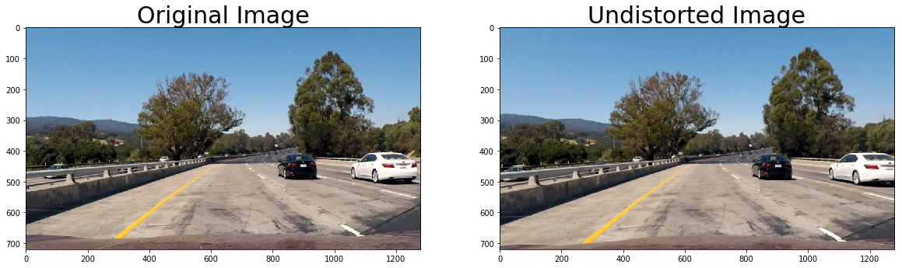
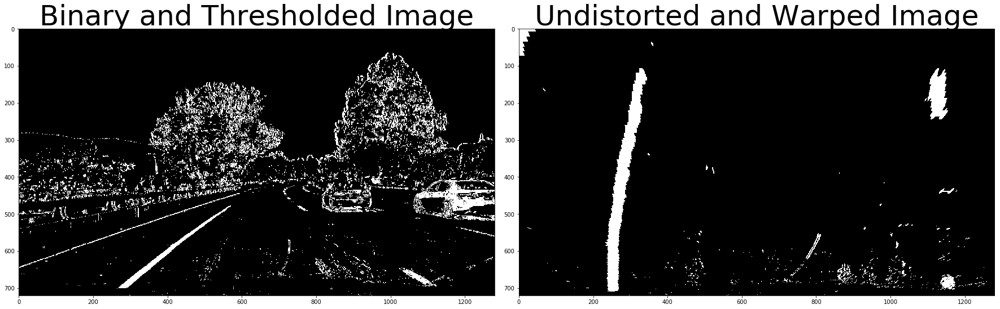
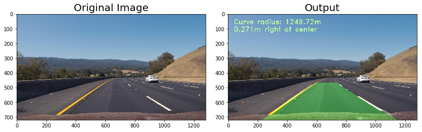

## Writeup 

**Advanced Lane Finding Project**

The goals / steps of this project are the following:

* Compute the camera calibration matrix and distortion coefficients given a set of chessboard images.
* Apply a distortion correction to raw images.
* Use color transforms, gradients, etc., to create a thresholded binary image.
* Apply a perspective transform to rectify binary image ("birds-eye view").
* Detect lane pixels and fit to find the lane boundary.
* Determine the curvature of the lane and vehicle position with respect to center.
* Warp the detected lane boundaries back onto the original image.
* Output visual display of the lane boundaries and numerical estimation of lane curvature and vehicle position.

[//]: # (Image References)

[image1]: ./examples/undistort_output.png "Undistorted"
[image2]: ./test_images/test1.jpg "Road Transformed"
[image3]: ./examples/binary_combo_example.jpg "Binary Example"
[image4]: ./examples/warped_straight_lines.jpg "Warp Example"
[image5]: ./examples/color_fit_lines.jpg "Fit Visual"
[image6]: ./examples/example_output.jpg "Output"
[video1]: ./project_video.mp4 "Video"

### Camera Calibration

#### 1. Briefly state how you computed the camera matrix and distortion coefficients. Provide an example of a distortion corrected calibration image.

The code for this step is contained in the first code cell of the IPython notebook located in "./main.ipynb".  

I start by preparing "object points", which will be the (x, y, z) coordinates of the chessboard corners in the world. Here I am assuming the chessboard is fixed on the (x, y) plane at z=0, such that the object points are the same for each calibration image.  Thus, `objp` is just a replicated array of coordinates, and `objpoints` will be appended with a copy of it every time I successfully detect all chessboard corners in a test image.  `imgpoints` will be appended with the (x, y) pixel position of each of the corners in the image plane with each successful chessboard detection.  

I then used the output `objpoints` and `imgpoints` to compute the camera calibration and distortion coefficients using the `cv2.calibrateCamera()` function.  I applied this distortion correction to the test image using the `cv2.undistort()` function and obtained this result: 


### Pipeline (single images)

#### 1. Distortion-correction.

To demonstrate this step, I will describe how I apply the distortion correction to one of the test images like this one:


#### 2. Creating a thresholded binary image.

I used a combination of color and gradient thresholds to generate a binary image in the IPython notebook.  Here's an example of my output for this step. The final binary image is a combination of binary thresholding the S channel (HLS) and binary thresholding the result of applying the Sobel operator in the x direction on the original image.


#### 3. Describe how (and identify where in your code) you performed a perspective transform and provide an example of a transformed image.

The code for my perspective transform includes a function called `warper()` in the IPython notebook.  The `warper()` function takes as inputs an image (`img`), as well as source (`src`) and destination (`dst`) points.  I chose the hardcode the source and destination points in the following manner:

```python
src = np.array([[(width*0.4, height*0.65),
                        (width*0.6, height*0.65),
                        (width, height),
                        (0, height)]], 
                        dtype=np.float32)
dst = np.array([[0,0], 
                    [img.shape[1], 0], 
                    [img.shape[1], img.shape[0]],
                    [0, img.shape[0]]],
                    dtype = 'float32') 
```

This resulted in the following source and destination points:

| Source        | Destination   | 
|:-------------:|:-------------:| 
|  512, 468     |   0,    0     | 
|  768, 468     | 1280, 720     |
| 1280, 720     | 1280, 720     |
|    0, 720     |    0, 720     |

I verified that my perspective transform was working as expected by drawing the `src` and `dst` points onto a test image and its warped counterpart to verify that the lines appear parallel in the warped image.



#### 4. Identifying lane-line pixels to fit their positions with a polynomial

The cell of "# Create an image to draw on and an image to show the selection window" is to fit my lane lines with a 2nd order polynomial, shown below:


#### 5. Radius of curvature of the lane and the position of the vehicle with respect to center.

I did this in the cell of "Measuring Curvature" which has a function called measure_radius_of_curvature and then I can compute the offset from the center. 

#### 6. My result plotted back down onto the road such that the lane area is identified clearly.

I implemented this step in cell of "draw detected lane lines on all test images" in the notebook.  Here are my result based on the test image (the curvature and deviation shown on the images, with oder of magnitude simliar to 1 km):


---

### Strategy
The previous pipeline fails to predict the corrected lane lines in some frames. 

The new pipeline is starting form cell called "# Corrected image processing pipeline". After several methods are tested, My strategy is as follows:
When there is large deviation between the current and previous frame, several sanity checks (especially for windows) are done; bad current frame is discarded and characteristics from the previous frame are used.

#### Here's a [link to my video result](./project_video_out_final.mp4).

---

### Discussion

The pipeline fails in the continus, sharp turn in the mountain in the harder-challenge video. The detected lines are cross to the line in the opposite direction or neighboring mortorcycle. If I were going to pursue this project, I would apply smoothing/averging or look-ahead (or hight pass, low pass) filter methods to improve the prediction.  
